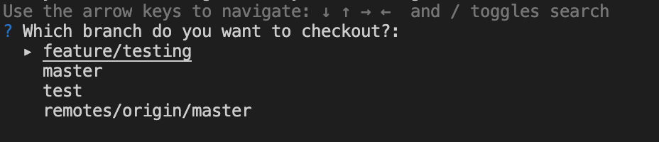
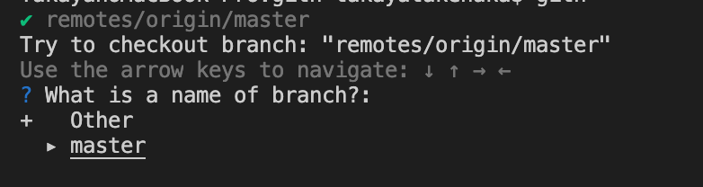

# gith

git checkout helper.

## install

> go get github.com/ticktakclock/gith

## usage

> gith

`/` key, you can search branch by word

If you select remote branch, confirm branch name.

`Other` enter the name you want to checkout.

